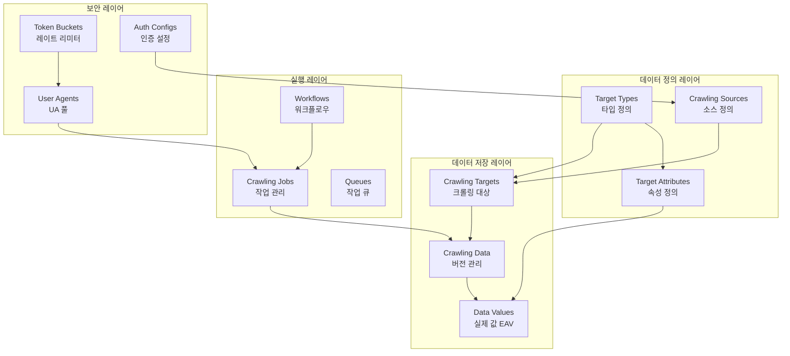
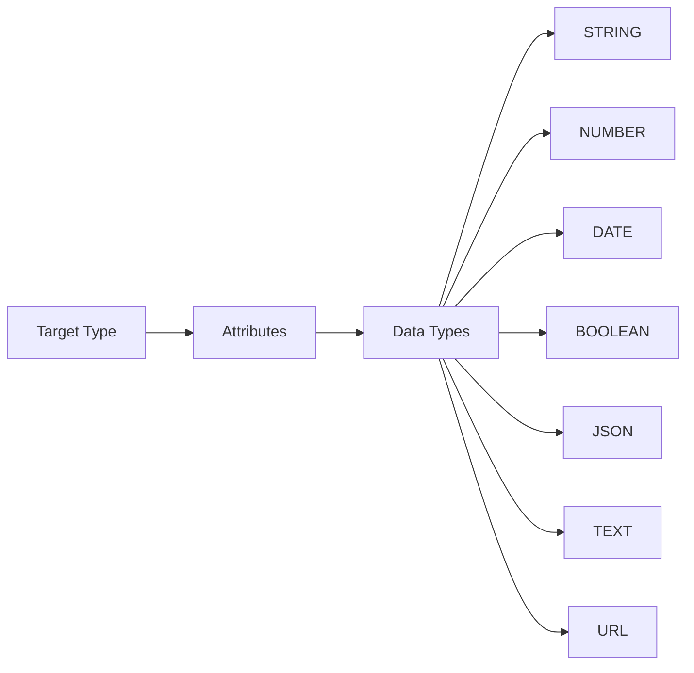

# 🏗️ 범용 크롤링 시스템 데이터베이스 스키마 설계

## 📌 설계 철학

### 핵심 원칙
1. **범용성 (Universality)**: 상품, 브랜드, 뉴스, SNS 등 모든 타입의 데이터 크롤링 지원
2. **확장성 (Scalability)**: 스키마 변경 없이 새로운 데이터 타입 추가 가능
3. **유연성 (Flexibility)**: 런타임에 속성 추가/변경 가능한 EAV 패턴 적용
4. **정규화 (Normalization)**: JSON 최소화, 완전 정규화된 구조

## 📋 목차
1. [시스템 개요](#시스템-개요)
2. [아키텍처](#아키텍처)
3. [핵심 설계 패턴](#핵심-설계-패턴)
4. [도메인 구조](#도메인-구조)
5. [스키마 확장성](#스키마-확장성)
6. [성능 최적화](#성능-최적화)

## 시스템 개요

### 🎯 시스템 목표
- **범용 크롤링 플랫폼**: 어떤 웹 데이터든 수집 가능한 범용 시스템
- **동적 스키마**: 코드 변경 없이 새로운 데이터 타입 지원
- **지능형 우회**: User-Agent 로테이션, 토큰 버킷, 프록시 관리
- **실시간 확장**: 런타임에 새로운 소스와 타입 추가 가능

### 🔑 핵심 특징
1. **타입 독립적**: 특정 비즈니스 도메인에 종속되지 않음
2. **메타데이터 기반**: 타입과 속성을 메타데이터로 정의
3. **EAV 패턴**: Entity-Attribute-Value 패턴으로 무한 확장
4. **완전 정규화**: JSON 대신 정규화된 테이블 구조

## 아키텍처



## 핵심 설계 패턴

### 1. EAV (Entity-Attribute-Value) 패턴

```sql
-- Entity: 크롤링 대상
crawling_targets (id, source_id, type_id, target_code)
    ↓
-- Attribute: 타입별 속성 정의
target_attributes (id, type_id, attribute_code, data_type)
    ↓
-- Value: 실제 데이터 값
crawling_data_values (data_id, attribute_id, value_text, value_number, ...)
```

### 2. 타입 시스템



### 3. 버전 관리

모든 크롤링 데이터는 버전 관리되며, 변경 이력 추적 가능:
- `crawling_data`: 각 크롤링 시점의 스냅샷
- `version_hash`: 데이터 변경 감지
- `is_current`: 최신 버전 표시

## 도메인 구조

### 📦 핵심 도메인 (4개)

#### 1. **타겟 도메인** (Target Domain)
범용 크롤링 대상 정의 및 데이터 저장
```
├── crawling_sources      # 크롤링 소스 (사이트, API)
├── target_types          # 데이터 타입 정의
├── target_attributes     # 타입별 속성 메타데이터
├── crawling_targets      # 크롤링 대상
├── crawling_data         # 데이터 버전 관리
└── crawling_data_values  # 실제 데이터 값 (EAV)
```

#### 2. **워크플로우 도메인** (Workflow Domain)
크롤링 작업 관리 및 실행
```
├── crawling_workflows    # 워크플로우 정의
├── workflow_steps        # 워크플로우 단계
├── crawling_jobs         # 크롤링 작업
├── crawling_tasks        # 세부 태스크
├── crawling_queues       # 작업 큐
└── crawling_schedules    # 스케줄링
```

#### 3. **보안 도메인** (Security Domain)
우회 및 인증 시스템
```
├── user_agents           # User-Agent 풀
├── token_buckets         # 레이트 리미터
├── source_auth_configs   # 인증 설정
├── crawling_headers      # HTTP 헤더
├── crawling_rules        # 크롤링 규칙
└── ip_rotations         # 프록시 관리
```

#### 4. **모니터링 도메인** (Monitoring Domain)
성능 추적 및 알림
```
├── crawling_metrics      # 성능 메트릭
├── error_logs           # 에러 로그
├── system_health        # 시스템 상태
├── alert_configurations # 알림 설정
└── data_quality_metrics # 데이터 품질
```

## 스키마 확장성

### 🚀 새로운 데이터 타입 추가 예시

#### 1. 타입 정의 (코드 변경 없음)
```sql
-- 부동산 크롤링 추가
INSERT INTO target_types (type_code, type_name) 
VALUES ('REAL_ESTATE', '부동산');

-- 암호화폐 정보 추가
INSERT INTO target_types (type_code, type_name) 
VALUES ('CRYPTO', '암호화폐');

-- 날씨 정보 추가
INSERT INTO target_types (type_code, type_name) 
VALUES ('WEATHER', '날씨');
```

#### 2. 속성 정의 (스키마 변경 없음)
```sql
-- 부동산 속성 정의
INSERT INTO target_attributes (type_id, attribute_code, attribute_name, data_type) VALUES
(@real_estate_id, 'address', '주소', 'STRING'),
(@real_estate_id, 'price', '가격', 'NUMBER'),
(@real_estate_id, 'area_sqm', '면적', 'NUMBER'),
(@real_estate_id, 'rooms', '방수', 'NUMBER');
```

#### 3. 즉시 사용 가능
```sql
-- 크롤링 대상 추가
INSERT INTO crawling_targets (source_id, type_id, target_code, target_url) 
VALUES (@source, @real_estate_id, 'APT_001', 'https://...');

-- 데이터 저장
INSERT INTO crawling_data_values (data_id, attribute_id, value_text)
VALUES (@data_id, @address_attr, '서울시 강남구...');
```

### 📊 지원 가능한 데이터 타입들

- **전자상거래**: 상품, 리뷰, 셀러, 가격, 재고
- **뉴스/미디어**: 기사, 댓글, 동영상, 이미지
- **SNS**: 포스트, 팔로워, 좋아요, 공유
- **부동산**: 매물, 시세, 거래 내역
- **금융**: 주가, 환율, 암호화폐
- **날씨/환경**: 기온, 습도, 미세먼지
- **문서**: PDF, 보고서, 공시
- ... 무제한 확장 가능

## 성능 최적화

### 1. 인덱싱 전략
```sql
-- EAV 조회 최적화
CREATE INDEX idx_values_lookup 
ON crawling_data_values(attribute_id, data_id);

-- 타입별 값 조회
CREATE INDEX idx_values_by_type 
ON crawling_data_values(attribute_id, value_text(100));
```

### 2. Materialized View
```sql
-- 자주 조회되는 데이터는 View로 최적화
CREATE MATERIALIZED VIEW mv_current_products AS
SELECT /* EAV를 일반 테이블처럼 변환 */
```

### 3. 파티셔닝
```sql
-- 시계열 데이터 파티셔닝
ALTER TABLE crawling_data 
PARTITION BY RANGE (TO_DAYS(crawled_at));
```

### 4. 캐싱 전략
- **메타데이터**: Redis에 타입/속성 정의 캐싱
- **최신 데이터**: 자주 조회되는 current 데이터 캐싱
- **집계 데이터**: 통계/메트릭 사전 계산

## 📈 장점

1. **무한 확장**: 어떤 데이터 타입도 추가 가능
2. **스키마 독립성**: 애플리케이션 배포 없이 새 타입 추가
3. **완전 정규화**: JSON 최소화로 쿼리/인덱싱 최적화
4. **버전 관리**: 모든 데이터의 변경 이력 추적
5. **타입 안정성**: 데이터 타입별 검증 가능

## 🎓 설계 원칙

### 정규화 원칙
- **1NF**: 원자값만 저장 (JSON은 최소화)
- **2NF**: 부분 함수 종속 제거
- **3NF**: 이행적 함수 종속 제거
- **BCNF**: 모든 결정자가 후보키

### 확장성 원칙
- **Open-Closed**: 확장에는 열려있고 수정에는 닫혀있음
- **DRY**: 중복 제거, 메타데이터 재사용
- **KISS**: 복잡한 로직은 애플리케이션 레이어로

## 다음 문서

1. [01-target-domain.md](01-target-domain.md) - 타겟 도메인 상세
2. [02-workflow-domain.md](02-workflow-domain.md) - 워크플로우 도메인 상세
3. [03-security-domain.md](03-security-domain.md) - 보안 도메인 상세
4. [04-monitoring-domain.md](04-monitoring-domain.md) - 모니터링 도메인 상세
5. [05-migration-guide.md](05-migration-guide.md) - 마이그레이션 가이드
