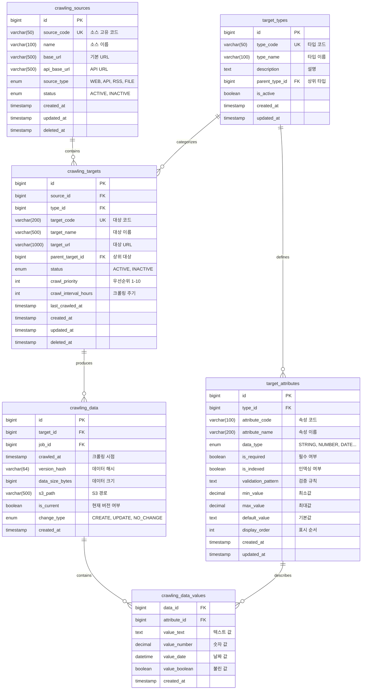

# 📦 타겟 도메인 (Target Domain) 스키마 설계

## 📌 개요

타겟 도메인은 크롤링 시스템의 핵심으로, **범용 데이터 모델**을 제공합니다.
특정 비즈니스 도메인(상품, 셀러 등)에 종속되지 않고, 어떤 타입의 데이터든 수집할 수 있는 유연한 구조입니다.

### 핵심 개념
- **Source**: 데이터를 가져올 출처 (웹사이트, API 등)
- **Type**: 데이터의 종류 (상품, 뉴스, 리뷰 등)
- **Target**: 실제 크롤링할 대상
- **Attribute**: 타입별 속성 정의
- **Value**: 실제 데이터 값 (EAV 패턴)

## 📊 ERD (Entity Relationship Diagram)



## 📝 테이블 상세 설명

### 1. crawling_sources (크롤링 소스)

데이터를 수집할 출처를 정의하는 테이블

#### 주요 컬럼
- **source_code**: 시스템 내부 고유 식별자 (MUSTIT, NAVER_NEWS 등)
- **source_type**: 소스 유형
  - `WEB`: 웹 크롤링
  - `API`: REST API
  - `RSS`: RSS 피드
  - `FILE`: 파일 시스템
  - `DATABASE`: 데이터베이스

#### 예시 데이터
```sql
INSERT INTO crawling_sources (source_code, name, base_url, source_type) VALUES
('MUSTIT', '머스트잇', 'https://mustit.co.kr', 'API'),
('NAVER_NEWS', '네이버뉴스', 'https://news.naver.com', 'WEB'),
('INSTAGRAM', '인스타그램', 'https://instagram.com', 'WEB'),
('WEATHER_API', '날씨API', 'https://api.weather.com', 'API');
```

#### 인덱스
```sql
CREATE UNIQUE INDEX uk_sources_code ON crawling_sources(source_code);
CREATE INDEX idx_sources_status ON crawling_sources(status, deleted_at);
```

### 2. target_types (타겟 타입)

크롤링할 데이터의 타입을 정의하는 메타데이터 테이블

#### 주요 컬럼
- **type_code**: 타입 고유 코드
- **parent_type_id**: 계층 구조 지원 (카테고리 > 서브카테고리)

#### 타입 예시
```sql
INSERT INTO target_types (type_code, type_name, description) VALUES
-- 전자상거래
('PRODUCT', '상품', '판매 상품 정보'),
('SELLER', '셀러', '판매자 정보'),
('REVIEW', '리뷰', '상품 리뷰'),
('BRAND', '브랜드', '브랜드 정보'),

-- 뉴스/미디어
('NEWS_ARTICLE', '뉴스기사', '뉴스 기사'),
('BLOG_POST', '블로그포스트', '블로그 게시물'),
('VIDEO', '동영상', '동영상 콘텐츠'),

-- SNS
('SOCIAL_POST', 'SNS포스트', '소셜미디어 게시물'),
('COMMENT', '댓글', '댓글/커멘트'),

-- 금융
('STOCK_PRICE', '주가', '주식 시세'),
('CRYPTO', '암호화폐', '암호화폐 정보'),
('EXCHANGE_RATE', '환율', '환율 정보'),

-- 부동산
('REAL_ESTATE', '부동산', '부동산 매물'),
('RENTAL', '임대', '임대 정보'),

-- 기타
('WEATHER', '날씨', '날씨 정보'),
('EVENT', '이벤트', '이벤트/행사'),
('DOCUMENT', '문서', 'PDF/문서');
```

### 3. target_attributes (타겟 속성)

각 타입별로 가질 수 있는 속성을 정의하는 메타데이터 테이블

#### 데이터 타입
- `STRING`: 문자열 (최대 255자)
- `TEXT`: 긴 텍스트
- `NUMBER`: 숫자 (소수점 포함)
- `DATE`: 날짜/시간
- `BOOLEAN`: 참/거짓
- `JSON`: JSON 객체 (최소화 사용)
- `URL`: URL
- `EMAIL`: 이메일

#### 속성 정의 예시
```sql
-- 상품 타입 속성
SET @product_type = (SELECT id FROM target_types WHERE type_code = 'PRODUCT');
INSERT INTO target_attributes (type_id, attribute_code, attribute_name, data_type, is_required, is_indexed) VALUES
(@product_type, 'name', '상품명', 'STRING', TRUE, TRUE),
(@product_type, 'price', '가격', 'NUMBER', TRUE, TRUE),
(@product_type, 'brand', '브랜드', 'STRING', FALSE, TRUE),
(@product_type, 'category', '카테고리', 'STRING', FALSE, TRUE),
(@product_type, 'description', '설명', 'TEXT', FALSE, FALSE),
(@product_type, 'image_url', '이미지URL', 'URL', FALSE, FALSE),
(@product_type, 'stock', '재고', 'NUMBER', FALSE, TRUE),
(@product_type, 'rating', '평점', 'NUMBER', FALSE, TRUE);

-- 뉴스 기사 속성
SET @news_type = (SELECT id FROM target_types WHERE type_code = 'NEWS_ARTICLE');
INSERT INTO target_attributes (type_id, attribute_code, attribute_name, data_type, is_required, is_indexed) VALUES
(@news_type, 'title', '제목', 'STRING', TRUE, TRUE),
(@news_type, 'content', '본문', 'TEXT', TRUE, FALSE),
(@news_type, 'author', '작성자', 'STRING', FALSE, TRUE),
(@news_type, 'published_date', '발행일', 'DATE', TRUE, TRUE),
(@news_type, 'category', '카테고리', 'STRING', FALSE, TRUE),
(@news_type, 'tags', '태그', 'JSON', FALSE, FALSE),
(@news_type, 'view_count', '조회수', 'NUMBER', FALSE, FALSE);
```

### 4. crawling_targets (크롤링 대상)

실제 크롤링할 대상을 정의하는 테이블

#### 주요 기능
- **계층 구조**: parent_target_id로 트리 구조 표현
- **우선순위**: 1(낮음) ~ 10(높음)
- **크롤링 주기**: 시간 단위로 설정

#### 예시 데이터
```sql
-- MUSTIT 셀러들
INSERT INTO crawling_targets (source_id, type_id, target_code, target_name, target_url, crawl_priority, crawl_interval_hours) VALUES
(@mustit_id, @seller_type, 'SELLER_001', '프리미엄셀러A', 'https://mustit.co.kr/shop/001', 9, 1),
(@mustit_id, @seller_type, 'SELLER_002', '일반셀러B', 'https://mustit.co.kr/shop/002', 5, 6);

-- 네이버 뉴스 카테고리
INSERT INTO crawling_targets (source_id, type_id, target_code, target_name, target_url, crawl_priority, crawl_interval_hours) VALUES
(@naver_id, @news_type, 'NAVER_IT', 'IT뉴스', 'https://news.naver.com/it', 7, 1),
(@naver_id, @news_type, 'NAVER_ECONOMY', '경제뉴스', 'https://news.naver.com/economy', 6, 2);
```

### 5. crawling_data (크롤링 데이터 버전)

크롤링된 데이터의 버전을 관리하는 테이블

#### 주요 기능
- **버전 관리**: 모든 크롤링 시점의 데이터 보존
- **변경 감지**: version_hash로 데이터 변경 추적
- **현재 버전**: is_current로 최신 데이터 표시

#### 인덱스
```sql
CREATE INDEX idx_data_target_current ON crawling_data(target_id, is_current, crawled_at DESC);
CREATE INDEX idx_data_version ON crawling_data(version_hash);
```

### 6. crawling_data_values (데이터 값 - EAV)

실제 크롤링된 데이터 값을 저장하는 EAV(Entity-Attribute-Value) 테이블

#### 특징
- **타입별 컬럼**: 데이터 타입에 따라 적절한 컬럼 사용
- **NULL 허용**: 해당 타입이 아닌 컬럼은 NULL
- **복합 기본키**: (data_id, attribute_id)

#### 데이터 저장 예시
```sql
-- 상품 데이터 저장
INSERT INTO crawling_data_values (data_id, attribute_id, value_text, value_number) VALUES
(@data_id, @name_attr, '프라다 가방', NULL),
(@data_id, @price_attr, NULL, 1500000),
(@data_id, @brand_attr, 'PRADA', NULL),
(@data_id, @stock_attr, NULL, 5);
```

## 🔧 정규화된 설정 테이블

### source_auth_configs (인증 설정)
```sql
CREATE TABLE source_auth_configs (
    id BIGINT AUTO_INCREMENT PRIMARY KEY,
    source_id BIGINT NOT NULL,
    auth_type ENUM('NONE', 'BASIC', 'BEARER', 'OAUTH', 'API_KEY', 'COOKIE'),
    auth_key VARCHAR(100),
    auth_value VARBINARY(1000), -- 암호화
    auth_location ENUM('HEADER', 'QUERY', 'BODY', 'COOKIE'),
    expires_at TIMESTAMP NULL,
    FOREIGN KEY (source_id) REFERENCES crawling_sources(id)
);
```

### crawling_headers (HTTP 헤더)
```sql
CREATE TABLE crawling_headers (
    id BIGINT AUTO_INCREMENT PRIMARY KEY,
    source_id BIGINT NOT NULL,
    header_name VARCHAR(100),
    header_value TEXT,
    is_active BOOLEAN DEFAULT TRUE,
    FOREIGN KEY (source_id) REFERENCES crawling_sources(id)
);
```

### crawling_rules (크롤링 규칙)
```sql
CREATE TABLE crawling_rules (
    id BIGINT AUTO_INCREMENT PRIMARY KEY,
    source_id BIGINT NOT NULL,
    rule_type ENUM('DELAY', 'RETRY', 'TIMEOUT', 'RATE_LIMIT'),
    rule_value VARCHAR(500),
    rule_unit VARCHAR(20),
    FOREIGN KEY (source_id) REFERENCES crawling_sources(id)
);
```

## 🔄 데이터 흐름

### 1. 새로운 타입 추가 (런타임)
```sql
-- 1. 타입 정의
INSERT INTO target_types (type_code, type_name) 
VALUES ('PODCAST', '팟캐스트');

-- 2. 속성 정의
INSERT INTO target_attributes (type_id, attribute_code, attribute_name, data_type) VALUES
(@podcast_id, 'title', '제목', 'STRING'),
(@podcast_id, 'duration', '재생시간', 'NUMBER'),
(@podcast_id, 'publish_date', '발행일', 'DATE');

-- 3. 바로 사용 가능! (코드 변경 없음)
```

### 2. 데이터 크롤링 및 저장
```sql
-- 1. 크롤링 데이터 버전 생성
INSERT INTO crawling_data (target_id, job_id, version_hash, is_current)
VALUES (@target_id, @job_id, MD5(data), TRUE);

-- 2. 이전 버전 플래그 해제
UPDATE crawling_data 
SET is_current = FALSE 
WHERE target_id = @target_id AND id != @new_data_id;

-- 3. 데이터 값 저장
INSERT INTO crawling_data_values (data_id, attribute_id, value_text)
SELECT @new_data_id, id, @crawled_value
FROM target_attributes
WHERE type_id = @type_id AND attribute_code = @attr_code;
```

### 3. 데이터 조회 (EAV → 일반 형태)
```sql
-- 특정 타겟의 현재 데이터 조회
SELECT 
    ta.attribute_name,
    COALESCE(
        cdv.value_text,
        CAST(cdv.value_number AS CHAR),
        DATE_FORMAT(cdv.value_date, '%Y-%m-%d'),
        CASE cdv.value_boolean WHEN 1 THEN 'true' ELSE 'false' END
    ) as value
FROM crawling_data cd
JOIN crawling_data_values cdv ON cd.id = cdv.data_id
JOIN target_attributes ta ON cdv.attribute_id = ta.id
WHERE cd.target_id = @target_id 
  AND cd.is_current = TRUE
ORDER BY ta.display_order;
```

## 📈 성능 최적화

### 1. Materialized View 활용
```sql
-- 자주 조회되는 상품 데이터는 View로 변환
CREATE MATERIALIZED VIEW mv_current_products AS
SELECT 
    t.id as target_id,
    t.target_code as product_code,
    MAX(CASE WHEN ta.attribute_code = 'name' THEN cdv.value_text END) as name,
    MAX(CASE WHEN ta.attribute_code = 'price' THEN cdv.value_number END) as price,
    MAX(CASE WHEN ta.attribute_code = 'brand' THEN cdv.value_text END) as brand,
    MAX(CASE WHEN ta.attribute_code = 'stock' THEN cdv.value_number END) as stock
FROM crawling_targets t
JOIN crawling_data cd ON t.id = cd.target_id AND cd.is_current = TRUE
JOIN crawling_data_values cdv ON cd.id = cdv.data_id
JOIN target_attributes ta ON cdv.attribute_id = ta.id
WHERE t.type_id = (SELECT id FROM target_types WHERE type_code = 'PRODUCT')
GROUP BY t.id, t.target_code;
```

### 2. 인덱싱 전략
```sql
-- EAV 조회 최적화
CREATE INDEX idx_values_composite ON crawling_data_values(data_id, attribute_id, value_text(50));
CREATE INDEX idx_values_number ON crawling_data_values(attribute_id, value_number) WHERE value_number IS NOT NULL;
CREATE INDEX idx_values_date ON crawling_data_values(attribute_id, value_date) WHERE value_date IS NOT NULL;
```

### 3. 파티셔닝
```sql
-- 크롤링 데이터 월별 파티셔닝
ALTER TABLE crawling_data
PARTITION BY RANGE (TO_DAYS(crawled_at)) (
    PARTITION p2024_01 VALUES LESS THAN (TO_DAYS('2024-02-01')),
    PARTITION p2024_02 VALUES LESS THAN (TO_DAYS('2024-03-01')),
    PARTITION p_future VALUES LESS THAN MAXVALUE
);
```

## 🎯 장점

1. **무한 확장성**: 스키마 변경 없이 새로운 타입 추가
2. **완전 정규화**: JSON 최소화, 인덱싱 가능
3. **버전 관리**: 모든 데이터의 변경 이력 추적
4. **타입 안정성**: 데이터 타입별 검증 가능
5. **유연한 구조**: 계층 관계, 동적 속성 지원

## 📚 관련 문서
- [00-overview.md](00-overview.md) - 전체 개요
- [02-workflow-domain.md](02-workflow-domain.md) - 워크플로우 도메인
- [05-migration-guide.md](05-migration-guide.md) - 마이그레이션 가이드
