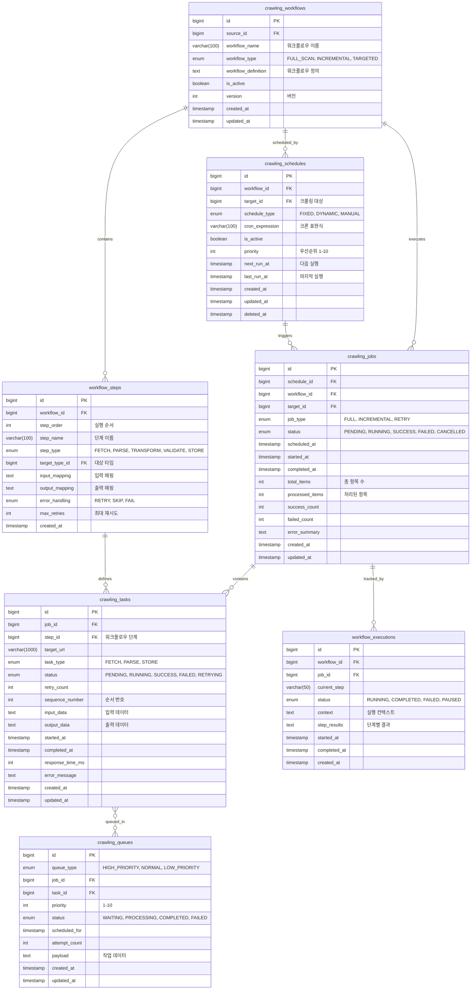

# 🔄 워크플로우 도메인 (Workflow Domain) 스키마 설계

## 📌 개요

워크플로우 도메인은 크롤링 작업의 실행과 관리를 담당합니다.
범용 타겟 시스템과 연동하여 다양한 타입의 데이터를 효율적으로 수집합니다.

### 핵심 개념
- **Workflow**: 크롤링 작업 흐름 정의
- **Job**: 실행 단위 작업
- **Task**: 세부 실행 태스크
- **Schedule**: 작업 스케줄링
- **Queue**: 작업 큐 관리

## 📊 ERD (Entity Relationship Diagram)



## 📝 테이블 상세 설명

### 1. crawling_workflows (워크플로우 정의)

크롤링 작업 흐름을 정의하는 마스터 테이블

#### 주요 컬럼
- **workflow_type**: 워크플로우 유형
  - `FULL_SCAN`: 전체 스캔
  - `INCREMENTAL`: 증분 업데이트
  - `TARGETED`: 특정 대상만
- **workflow_definition**: JSON 형태의 워크플로우 정의
  ```json
  {
    "steps": [
      {
        "name": "fetch_list",
        "type": "FETCH",
        "config": {
          "url_pattern": "{base_url}/list?page={page}",
          "pagination": true,
          "max_pages": 100
        }
      },
      {
        "name": "parse_items",
        "type": "PARSE",
        "config": {
          "parser": "html",
          "selectors": {
            "items": ".product-item",
            "name": ".title",
            "price": ".price"
          }
        }
      }
    ]
  }
  ```

#### 예시 데이터
```sql
INSERT INTO crawling_workflows (source_id, workflow_name, workflow_type) VALUES
(@mustit_id, 'MUSTIT 상품 수집', 'INCREMENTAL'),
(@naver_id, '네이버 뉴스 수집', 'FULL_SCAN'),
(@instagram_id, '인스타그램 포스트 수집', 'TARGETED');
```

### 2. workflow_steps (워크플로우 단계)

워크플로우의 각 실행 단계를 정의

#### 단계 타입
- **FETCH**: 데이터 가져오기
- **PARSE**: 파싱/추출
- **TRANSFORM**: 데이터 변환
- **VALIDATE**: 검증
- **STORE**: 저장

#### 에러 처리 전략
- **RETRY**: 재시도
- **SKIP**: 건너뛰기
- **FAIL**: 실패 처리

### 3. crawling_schedules (스케줄링)

크롤링 작업 스케줄 관리

#### 스케줄 타입
- **FIXED**: 고정 주기 (크론)
- **DYNAMIC**: 동적 조정
- **MANUAL**: 수동 실행

#### 크론 표현식 예시
```sql
-- 매일 새벽 2시
'0 2 * * *'

-- 30분마다
'*/30 * * * *'

-- 평일 오전 9시
'0 9 * * 1-5'
```

### 4. crawling_jobs (크롤링 작업)

실행 중이거나 완료된 크롤링 작업

#### 작업 상태 흐름
```
PENDING → RUNNING → SUCCESS
                  ↘ FAILED
                  ↘ CANCELLED
```

#### 통계 정보
- **total_items**: 처리할 총 항목 수
- **processed_items**: 처리 완료 항목
- **success_count**: 성공 개수
- **failed_count**: 실패 개수

### 5. crawling_tasks (세부 태스크)

작업의 세부 실행 단위

#### 주요 기능
- **재시도 관리**: retry_count로 재시도 추적
- **순서 보장**: sequence_number로 실행 순서 관리
- **성능 추적**: response_time_ms로 응답 시간 측정

#### 인덱스
```sql
CREATE INDEX idx_tasks_job_status ON crawling_tasks(job_id, status);
CREATE INDEX idx_tasks_retry ON crawling_tasks(status, retry_count) 
  WHERE status = 'FAILED' AND retry_count < 3;
```

### 6. crawling_queues (작업 큐)

비동기 작업 큐 관리

#### 큐 우선순위
- **HIGH_PRIORITY**: 즉시 실행
- **NORMAL**: 일반 우선순위
- **LOW_PRIORITY**: 유휴 시간 실행

#### 큐 처리 로직
```sql
-- 다음 실행할 작업 선택
SELECT * FROM crawling_queues
WHERE status = 'WAITING'
  AND scheduled_for <= NOW()
ORDER BY queue_type, priority DESC, created_at
LIMIT 10
FOR UPDATE SKIP LOCKED;
```

### 7. workflow_executions (워크플로우 실행 추적)

워크플로우 실행 상태 추적

#### 실행 컨텍스트 예시
```json
{
  "current_page": 5,
  "total_pages": 100,
  "items_processed": 300,
  "last_item_id": "PROD_12345",
  "checkpoint": {
    "step": "parse_items",
    "progress": 0.05
  }
}
```

## 🔧 고급 기능

### 1. 동적 워크플로우

```sql
-- 타입별 다른 워크플로우 적용
CREATE TABLE target_workflow_mappings (
    target_type_id BIGINT,
    workflow_id BIGINT,
    condition_expression TEXT, -- 조건식
    priority INT,
    PRIMARY KEY (target_type_id, workflow_id)
);
```

### 2. 의존성 관리

```sql
-- 작업 간 의존성
CREATE TABLE job_dependencies (
    job_id BIGINT,
    depends_on_job_id BIGINT,
    dependency_type ENUM('FINISH', 'SUCCESS'),
    PRIMARY KEY (job_id, depends_on_job_id)
);
```

### 3. 병렬 실행

```sql
-- 병렬 실행 설정
CREATE TABLE parallel_execution_config (
    workflow_id BIGINT PRIMARY KEY,
    max_parallel_jobs INT DEFAULT 5,
    max_parallel_tasks INT DEFAULT 10,
    resource_pool VARCHAR(50)
);
```

## 🔄 실행 흐름

### 1. 스케줄 기반 실행
```sql
-- 1. 실행 대상 스케줄 확인
SELECT * FROM crawling_schedules
WHERE is_active = TRUE
  AND next_run_at <= NOW()
ORDER BY priority DESC;

-- 2. Job 생성
INSERT INTO crawling_jobs (schedule_id, workflow_id, target_id, status)
VALUES (@schedule_id, @workflow_id, @target_id, 'PENDING');

-- 3. Task 생성
INSERT INTO crawling_tasks (job_id, step_id, target_url, status)
SELECT @job_id, ws.id, CONCAT(@base_url, ws.url_pattern), 'PENDING'
FROM workflow_steps ws
WHERE workflow_id = @workflow_id
ORDER BY step_order;

-- 4. 큐 등록
INSERT INTO crawling_queues (task_id, queue_type, priority, status)
SELECT id, 'NORMAL', 5, 'WAITING'
FROM crawling_tasks
WHERE job_id = @job_id;
```

### 2. 작업 실행 및 완료
```sql
-- 작업 시작
UPDATE crawling_jobs 
SET status = 'RUNNING', started_at = NOW()
WHERE id = @job_id;

-- 태스크 처리
UPDATE crawling_tasks
SET status = 'SUCCESS', 
    completed_at = NOW(),
    response_time_ms = TIMESTAMPDIFF(MICROSECOND, started_at, NOW()) / 1000
WHERE id = @task_id;

-- 작업 완료
UPDATE crawling_jobs
SET status = 'SUCCESS',
    completed_at = NOW(),
    processed_items = (SELECT COUNT(*) FROM crawling_tasks WHERE job_id = @job_id),
    success_count = (SELECT COUNT(*) FROM crawling_tasks WHERE job_id = @job_id AND status = 'SUCCESS')
WHERE id = @job_id;
```

## 📈 성능 최적화

### 1. 큐 파티셔닝
```sql
-- 큐 테이블 파티셔닝 (일별)
ALTER TABLE crawling_queues
PARTITION BY RANGE (TO_DAYS(created_at)) (
    PARTITION p_today VALUES LESS THAN (TO_DAYS(CURDATE() + INTERVAL 1 DAY)),
    PARTITION p_tomorrow VALUES LESS THAN (TO_DAYS(CURDATE() + INTERVAL 2 DAY)),
    PARTITION p_future VALUES LESS THAN MAXVALUE
);
```

### 2. 작업 아카이빙
```sql
-- 완료된 작업 아카이빙 (30일 이상)
INSERT INTO crawling_jobs_archive
SELECT * FROM crawling_jobs
WHERE completed_at < DATE_SUB(NOW(), INTERVAL 30 DAY);

DELETE FROM crawling_jobs
WHERE completed_at < DATE_SUB(NOW(), INTERVAL 30 DAY);
```

### 3. 통계 집계
```sql
-- 실시간 통계 View
CREATE VIEW v_job_statistics AS
SELECT 
    DATE(created_at) as job_date,
    workflow_id,
    COUNT(*) as total_jobs,
    SUM(CASE WHEN status = 'SUCCESS' THEN 1 ELSE 0 END) as success_jobs,
    AVG(TIMESTAMPDIFF(SECOND, started_at, completed_at)) as avg_duration_sec,
    SUM(processed_items) as total_items_processed
FROM crawling_jobs
WHERE created_at >= DATE_SUB(NOW(), INTERVAL 7 DAY)
GROUP BY DATE(created_at), workflow_id;
```

## 🎯 모니터링 포인트

### 주요 지표
1. **Job Success Rate**: 작업 성공률
2. **Average Execution Time**: 평균 실행 시간
3. **Queue Depth**: 큐 대기 깊이
4. **Retry Rate**: 재시도 비율

### 알림 조건
```sql
-- 실패율이 높은 워크플로우
SELECT workflow_id, 
       COUNT(*) as total,
       SUM(CASE WHEN status = 'FAILED' THEN 1 ELSE 0 END) as failed,
       (SUM(CASE WHEN status = 'FAILED' THEN 1 ELSE 0 END) / COUNT(*)) * 100 as failure_rate
FROM crawling_jobs
WHERE created_at >= DATE_SUB(NOW(), INTERVAL 1 HOUR)
GROUP BY workflow_id
HAVING failure_rate > 20;
```

## 📚 관련 문서
- [00-overview.md](00-overview.md) - 전체 개요
- [01-target-domain.md](01-target-domain.md) - 타겟 도메인
- [03-security-domain.md](03-security-domain.md) - 보안 도메인
