# 📊 모니터링 도메인 (Monitoring Domain) 스키마 설계

## 📌 개요

모니터링 도메인은 크롤링 시스템의 상태, 성능, 품질을 실시간으로 추적하고 분석합니다.
메트릭 수집, 에러 추적, 알림 관리, 대시보드 지원 등을 담당합니다.

### 핵심 기능
- **성능 메트릭**: 크롤링 속도, 성공률, 응답 시간
- **에러 추적**: 에러 로그 및 패턴 분석
- **데이터 품질**: 수집 데이터의 완전성 검증
- **실시간 알림**: 임계값 기반 알림
- **대시보드**: 시각화를 위한 집계 데이터

## 📊 ERD (Entity Relationship Diagram)

```mermaid
erDiagram
    crawling_metrics {
        bigint id PK
        bigint source_id FK
        bigint target_type_id FK
        varchar(50) metric_type "SUCCESS_RATE, SPEED, ERROR_RATE"
        date metric_date
        int hour "시간 (0-23)"
        bigint total_requests
        bigint successful_requests
        bigint failed_requests
        float avg_response_time_ms
        float p95_response_time_ms
        float p99_response_time_ms
        bigint total_bytes_downloaded
        bigint total_items_crawled
        timestamp created_at
    }
    
    error_logs {
        bigint id PK
        bigint job_id FK
        bigint task_id FK
        bigint source_id FK
        varchar(100) error_code
        varchar(200) error_type
        text error_message
        text stack_trace
        varchar(1000) request_url
        int status_code
        varchar(100) component "FETCHER, PARSER, STORAGE"
        enum severity "LOW, MEDIUM, HIGH, CRITICAL"
        boolean is_resolved
        timestamp occurred_at
        timestamp resolved_at
        timestamp created_at
    }
    
    system_health {
        bigint id PK
        varchar(100) component_name
        enum status "HEALTHY, DEGRADED, DOWN"
        float cpu_usage_percent
        float memory_usage_percent
        float disk_usage_percent
        bigint queue_depth
        int active_workers
        float avg_queue_wait_time_sec
        json health_checks
        timestamp checked_at
        timestamp created_at
    }
    
    data_quality_metrics {
        bigint id PK
        bigint source_id FK
        bigint target_type_id FK
        date check_date
        bigint total_records_checked
        bigint valid_records
        bigint invalid_records
        bigint missing_required_fields
        bigint duplicate_records
        float completeness_score "0-100"
        float accuracy_score "0-100"
        float consistency_score "0-100"
        json validation_errors
        timestamp checked_at
        timestamp created_at
    }
    
    alert_configurations {
        bigint id PK
        varchar(100) alert_name
        enum alert_type "THRESHOLD, ANOMALY, ERROR"
        varchar(100) metric_name
        enum condition_operator "GT, LT, EQ, GTE, LTE"
        float threshold_value
        int evaluation_period_minutes
        int consecutive_breaches
        enum severity "INFO, WARNING, ERROR, CRITICAL"
        varchar(100) notification_channel "EMAIL, SLACK, WEBHOOK"
        json notification_config
        boolean is_active
        timestamp created_at
        timestamp updated_at
    }
    
    alert_history {
        bigint id PK
        bigint alert_config_id FK
        enum status "TRIGGERED, RESOLVED, ACKNOWLEDGED"
        float metric_value
        float threshold_value
        text alert_message
        json alert_context
        timestamp triggered_at
        timestamp resolved_at
        timestamp acknowledged_at
        varchar(100) acknowledged_by
        timestamp created_at
    }
    
    performance_snapshots {
        bigint id PK
        timestamp snapshot_time
        int total_active_jobs
        int total_pending_jobs
        int total_failed_jobs
        float avg_job_duration_sec
        float system_cpu_percent
        float system_memory_percent
        bigint total_requests_per_min
        float avg_response_time_ms
        json detailed_metrics
        timestamp created_at
    }
    
    crawling_statistics {
        bigint id PK
        date stat_date
        varchar(50) stat_type "DAILY, WEEKLY, MONTHLY"
        bigint total_sources_active
        bigint total_targets_crawled
        bigint total_data_points_collected
        bigint total_bytes_processed
        float overall_success_rate
        float avg_crawl_duration_min
        json top_performing_sources
        json top_errors
        timestamp created_at
    }
    
    audit_logs {
        bigint id PK
        varchar(100) action_type "CONFIG_CHANGE, MANUAL_TRIGGER, SYSTEM_EVENT"
        varchar(100) entity_type "SOURCE, TARGET, WORKFLOW"
        bigint entity_id
        varchar(100) performed_by
        text action_description
        json old_value
        json new_value
        varchar(45) ip_address
        varchar(500) user_agent
        timestamp performed_at
        timestamp created_at
    }
    
    dashboard_widgets {
        bigint id PK
        varchar(100) widget_name
        varchar(50) widget_type "CHART, TABLE, METRIC, MAP"
        varchar(50) chart_type "LINE, BAR, PIE, GAUGE"
        text query_sql
        json display_config
        int refresh_interval_seconds
        int display_order
        boolean is_active
        timestamp created_at
        timestamp updated_at
    }
    
    alert_configurations ||--o{ alert_history : triggers
    crawling_sources ||--o{ crawling_metrics : measures
    crawling_sources ||--o{ error_logs : logs
    crawling_sources ||--o{ data_quality_metrics : validates
```



## 📝 테이블 상세 설명

### 1. crawling_metrics (크롤링 메트릭)

시간별/일별 크롤링 성능 지표

#### 주요 메트릭
- **SUCCESS_RATE**: 성공률
- **SPEED**: 크롤링 속도 (items/min)
- **ERROR_RATE**: 에러율
- **RESPONSE_TIME**: 응답 시간 분포

#### 집계 예시
```sql
-- 시간별 메트릭 집계
INSERT INTO crawling_metrics (source_id, target_type_id, metric_date, hour, total_requests, successful_requests)
SELECT 
    source_id,
    t.type_id,
    DATE(requested_at) as metric_date,
    HOUR(requested_at) as hour,
    COUNT(*) as total_requests,
    SUM(CASE WHEN status_code BETWEEN 200 AND 299 THEN 1 ELSE 0 END) as successful_requests
FROM request_logs rl
JOIN crawling_targets t ON rl.target_id = t.id
WHERE requested_at >= DATE_SUB(NOW(), INTERVAL 1 HOUR)
GROUP BY source_id, t.type_id, DATE(requested_at), HOUR(requested_at);
```

### 2. error_logs (에러 로그)

모든 에러 상세 기록

#### 에러 분류
- **Component**: FETCHER, PARSER, STORAGE
- **Severity**: LOW, MEDIUM, HIGH, CRITICAL

#### 에러 패턴 분석
```sql
-- 빈발 에러 패턴
SELECT 
    error_type,
    error_code,
    COUNT(*) as occurrence_count,
    AVG(CASE WHEN is_resolved THEN 1 ELSE 0 END) as resolution_rate
FROM error_logs
WHERE occurred_at >= DATE_SUB(NOW(), INTERVAL 24 HOUR)
GROUP BY error_type, error_code
ORDER BY occurrence_count DESC;
```

### 3. system_health (시스템 헬스)

시스템 리소스 및 컴포넌트 상태

#### 헬스 체크 항목
```json
{
  "database": {
    "status": "healthy",
    "latency_ms": 5,
    "connection_pool_usage": 0.3
  },
  "redis": {
    "status": "healthy",
    "memory_usage_mb": 512,
    "hit_rate": 0.95
  },
  "s3": {
    "status": "healthy",
    "latency_ms": 50
  },
  "queue": {
    "status": "degraded",
    "depth": 5000,
    "processing_rate": 100
  }
}
```

### 4. data_quality_metrics (데이터 품질)

수집 데이터의 품질 평가

#### 품질 점수
- **Completeness**: 필수 필드 완전성 (0-100)
- **Accuracy**: 데이터 정확성 (0-100)
- **Consistency**: 데이터 일관성 (0-100)

#### 검증 규칙
```sql
-- 데이터 품질 체크
CREATE PROCEDURE check_data_quality(IN p_source_id BIGINT, IN p_date DATE)
BEGIN
    DECLARE v_total_records BIGINT;
    DECLARE v_missing_required BIGINT;
    DECLARE v_duplicates BIGINT;
    
    -- 필수 필드 누락 체크
    SELECT COUNT(*), 
           SUM(CASE WHEN value_text IS NULL AND ta.is_required THEN 1 ELSE 0 END)
    INTO v_total_records, v_missing_required
    FROM crawling_data_values cdv
    JOIN target_attributes ta ON cdv.attribute_id = ta.id
    WHERE DATE(cdv.created_at) = p_date;
    
    -- 중복 체크
    SELECT COUNT(*) INTO v_duplicates
    FROM (
        SELECT target_id, version_hash, COUNT(*) as cnt
        FROM crawling_data
        WHERE DATE(crawled_at) = p_date
        GROUP BY target_id, version_hash
        HAVING cnt > 1
    ) dups;
    
    -- 메트릭 저장
    INSERT INTO data_quality_metrics (
        source_id, check_date, total_records_checked,
        missing_required_fields, duplicate_records,
        completeness_score
    ) VALUES (
        p_source_id, p_date, v_total_records,
        v_missing_required, v_duplicates,
        (1 - v_missing_required / v_total_records) * 100
    );
END;
```

### 5. alert_configurations (알림 설정)

임계값 기반 알림 규칙

#### 알림 타입
- **THRESHOLD**: 임계값 초과/미달
- **ANOMALY**: 이상 패턴 감지
- **ERROR**: 에러 발생

#### 알림 설정 예시
```sql
-- 성공률 70% 미만 알림
INSERT INTO alert_configurations (
    alert_name, alert_type, metric_name, 
    condition_operator, threshold_value,
    evaluation_period_minutes, severity
) VALUES (
    '낮은 성공률', 'THRESHOLD', 'success_rate',
    'LT', 70.0,
    5, 'WARNING'
);

-- 에러율 10% 초과 알림
INSERT INTO alert_configurations (
    alert_name, alert_type, metric_name,
    condition_operator, threshold_value,
    evaluation_period_minutes, severity
) VALUES (
    '높은 에러율', 'THRESHOLD', 'error_rate',
    'GT', 10.0,
    5, 'ERROR'
);
```

### 6. alert_history (알림 이력)

발생한 알림의 이력 관리

#### 알림 상태 흐름
```
TRIGGERED → ACKNOWLEDGED → RESOLVED
```

### 7. performance_snapshots (성능 스냅샷)

시스템 전체 성능 스냅샷 (1분 간격)

#### 스냅샷 수집
```sql
-- 1분마다 스냅샷 생성
CREATE EVENT collect_performance_snapshot
ON SCHEDULE EVERY 1 MINUTE
DO
    INSERT INTO performance_snapshots (
        snapshot_time,
        total_active_jobs,
        total_pending_jobs,
        avg_job_duration_sec,
        total_requests_per_min
    )
    SELECT 
        NOW(),
        SUM(CASE WHEN status = 'RUNNING' THEN 1 ELSE 0 END),
        SUM(CASE WHEN status = 'PENDING' THEN 1 ELSE 0 END),
        AVG(TIMESTAMPDIFF(SECOND, started_at, completed_at)),
        (SELECT COUNT(*) FROM request_logs WHERE requested_at >= DATE_SUB(NOW(), INTERVAL 1 MINUTE))
    FROM crawling_jobs
    WHERE created_at >= DATE_SUB(NOW(), INTERVAL 1 HOUR);
```

### 8. crawling_statistics (크롤링 통계)

일/주/월 단위 종합 통계

#### 통계 집계
```sql
-- 일별 통계 집계
CREATE PROCEDURE generate_daily_statistics(IN p_date DATE)
BEGIN
    INSERT INTO crawling_statistics (
        stat_date, stat_type,
        total_sources_active,
        total_targets_crawled,
        total_data_points_collected,
        overall_success_rate
    )
    SELECT 
        p_date, 'DAILY',
        COUNT(DISTINCT source_id),
        COUNT(DISTINCT target_id),
        SUM(processed_items),
        AVG(success_count / NULLIF(processed_items, 0))
    FROM crawling_jobs
    WHERE DATE(created_at) = p_date;
END;
```

### 9. audit_logs (감사 로그)

시스템 변경 사항 추적

#### 감사 대상
- 설정 변경
- 수동 작업 실행
- 권한 변경
- 중요 시스템 이벤트

### 10. dashboard_widgets (대시보드 위젯)

대시보드 구성을 위한 위젯 정의

#### 위젯 타입
- **CHART**: 차트 (라인, 바, 파이)
- **TABLE**: 테이블
- **METRIC**: 단일 지표
- **MAP**: 지도/히트맵

#### 위젯 설정 예시
```json
{
  "title": "크롤링 성공률 추이",
  "type": "LINE",
  "x_axis": "time",
  "y_axis": "success_rate",
  "period": "24h",
  "refresh": 60,
  "colors": ["#28a745", "#dc3545"]
}
```

## 📈 주요 대시보드 쿼리

### 1. 실시간 현황
```sql
-- 실시간 크롤링 현황
CREATE VIEW v_realtime_status AS
SELECT 
    (SELECT COUNT(*) FROM crawling_jobs WHERE status = 'RUNNING') as active_jobs,
    (SELECT COUNT(*) FROM crawling_jobs WHERE status = 'PENDING') as pending_jobs,
    (SELECT AVG(success_rate) FROM crawling_metrics WHERE metric_date = CURDATE()) as today_success_rate,
    (SELECT COUNT(*) FROM error_logs WHERE occurred_at >= DATE_SUB(NOW(), INTERVAL 1 HOUR) AND severity IN ('HIGH', 'CRITICAL')) as recent_critical_errors,
    (SELECT COUNT(*) FROM alert_history WHERE triggered_at >= DATE_SUB(NOW(), INTERVAL 1 HOUR) AND status = 'TRIGGERED') as active_alerts;
```

### 2. 소스별 성능
```sql
-- 소스별 성능 비교
CREATE VIEW v_source_performance AS
SELECT 
    s.name as source_name,
    cm.metric_date,
    cm.successful_requests / NULLIF(cm.total_requests, 0) * 100 as success_rate,
    cm.avg_response_time_ms,
    cm.total_items_crawled,
    dq.completeness_score,
    dq.accuracy_score
FROM crawling_sources s
LEFT JOIN crawling_metrics cm ON s.id = cm.source_id
LEFT JOIN data_quality_metrics dq ON s.id = dq.source_id AND cm.metric_date = dq.check_date
WHERE cm.metric_date >= DATE_SUB(CURDATE(), INTERVAL 7 DAY)
ORDER BY cm.metric_date DESC, success_rate DESC;
```

### 3. 에러 분석
```sql
-- Top 10 에러 유형
CREATE VIEW v_top_errors AS
SELECT 
    error_type,
    error_code,
    component,
    COUNT(*) as error_count,
    MAX(occurred_at) as last_occurred,
    AVG(CASE WHEN is_resolved THEN 
        TIMESTAMPDIFF(MINUTE, occurred_at, resolved_at) 
    END) as avg_resolution_time_min
FROM error_logs
WHERE occurred_at >= DATE_SUB(NOW(), INTERVAL 24 HOUR)
GROUP BY error_type, error_code, component
ORDER BY error_count DESC
LIMIT 10;
```

## 🚨 알림 규칙

### 1. 크리티컬 알림
```sql
-- 시스템 다운
INSERT INTO alert_configurations VALUES 
(NULL, '시스템 다운', 'THRESHOLD', 'system_health_status', 'EQ', 0, 1, 3, 'CRITICAL', 'SLACK', '{"channel": "#alerts"}', TRUE, NOW(), NOW());

-- 큐 과부하
INSERT INTO alert_configurations VALUES
(NULL, '큐 과부하', 'THRESHOLD', 'queue_depth', 'GT', 10000, 5, 2, 'ERROR', 'EMAIL', '{"to": "ops@example.com"}', TRUE, NOW(), NOW());
```

### 2. 성능 알림
```sql
-- 느린 응답 시간
INSERT INTO alert_configurations VALUES
(NULL, '느린 응답', 'THRESHOLD', 'p95_response_time', 'GT', 5000, 10, 3, 'WARNING', 'SLACK', '{"channel": "#performance"}', TRUE, NOW(), NOW());
```

## 📊 리포팅

### 일일 리포트
```sql
-- 일일 크롤링 요약 리포트
CREATE PROCEDURE generate_daily_report(IN p_date DATE)
BEGIN
    SELECT 
        'Daily Crawling Report' as report_title,
        p_date as report_date,
        (SELECT COUNT(DISTINCT source_id) FROM crawling_jobs WHERE DATE(created_at) = p_date) as active_sources,
        (SELECT COUNT(*) FROM crawling_jobs WHERE DATE(created_at) = p_date) as total_jobs,
        (SELECT SUM(processed_items) FROM crawling_jobs WHERE DATE(created_at) = p_date) as total_items,
        (SELECT AVG(success_count/NULLIF(processed_items,0))*100 FROM crawling_jobs WHERE DATE(created_at) = p_date) as avg_success_rate,
        (SELECT COUNT(*) FROM error_logs WHERE DATE(occurred_at) = p_date AND severity IN ('HIGH', 'CRITICAL')) as critical_errors,
        (SELECT AVG(completeness_score) FROM data_quality_metrics WHERE check_date = p_date) as avg_data_quality;
END;
```

## 📚 관련 문서
- [00-overview.md](00-overview.md) - 전체 개요
- [02-workflow-domain.md](02-workflow-domain.md) - 워크플로우 도메인
- [03-security-domain.md](03-security-domain.md) - 보안 도메인
